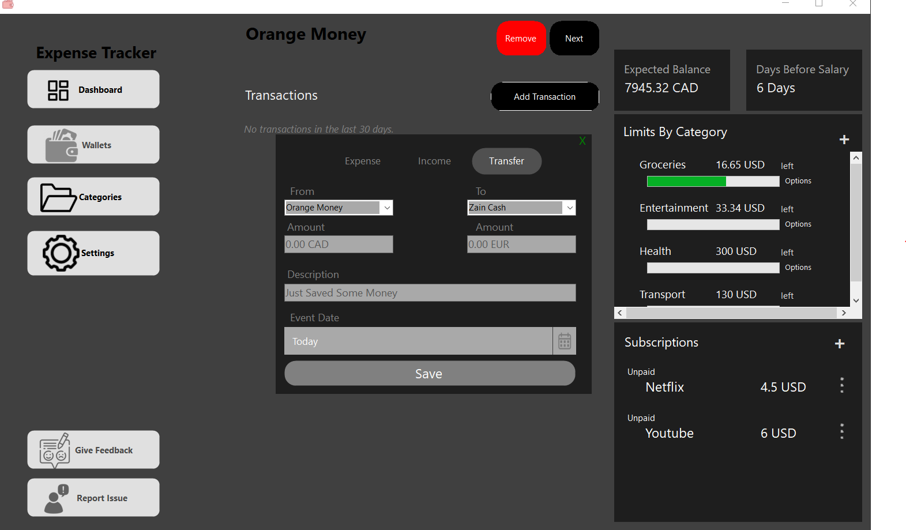
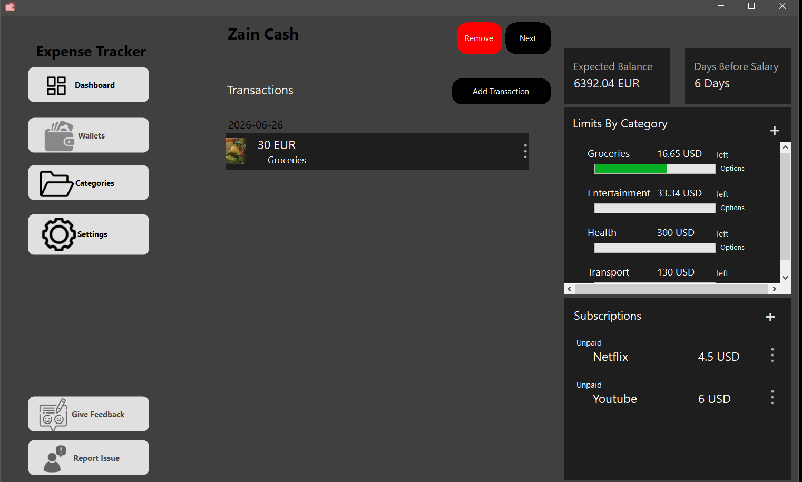
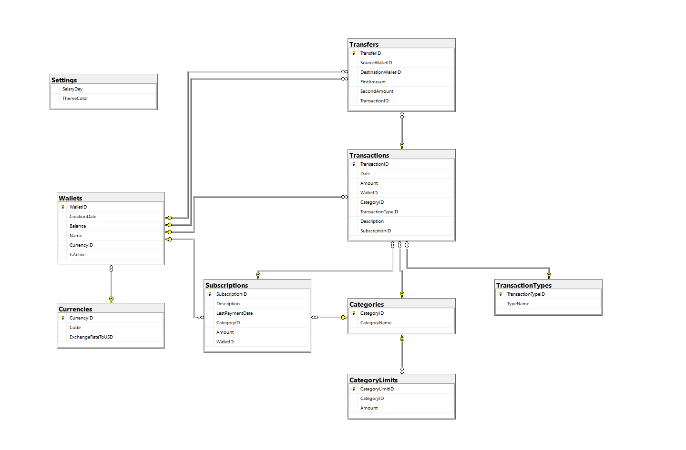

# Expense Tracker

A full-stack Windows Forms financial management application utilizing Entity Framework Core for strict data management and optimized database queries.

## 📸 Application Previews

## Tech Stack
* Frontend: Windows Forms (C#)
* ORM: Entity Framework Core
* Database: SQL Server

## Architecture Overview
This application integrates a robust desktop UI with modern data access technologies:
* UI Layer: Intuitive, dynamic Windows Forms interfaces that adjust state based on user input for seamless financial data entry and visualization.
* Data Access Layer: Implements Entity Framework Core to handle complex database transactions (such as inter-account transfers), relationships, and queries efficiently without writing raw SQL.
* Database: Fully relational SQL Server database ensuring ACID compliance and data integrity for all financial records.

## Database Architecture

## Key Features
* Multi-Currency Wallets: Aggregate totals and track individual transactions across different accounts and currencies (USD, EUR, CAD, AUD).
* Complex Transactions: Securely process income, expenses, and inter-account transfers using strict database logic to maintain balanced ledgers.
* Dynamic Budgeting & Subscriptions: Real-time visual tracking of category spending limits and recurring monthly subscriptions.
* Optimized Queries: Leverages LINQ to Entities for fast, secure data retrieval and aggregation.

## Local Setup
1. Clone the repository.
2. Update the SQL Server connection string in the application configuration file.
3. Open the Package Manager Console in Visual Studio and run `Update-Database` to apply EF Core migrations.
4. Build and run the solution.
